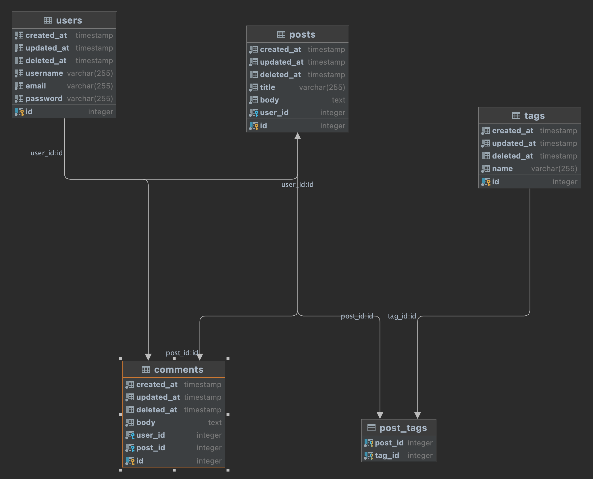

# gorm-demo

This is a sample Go project that uses the [GORM](https://gorm.io/) ORM library and the [PostgreSQL](https://www.postgresql.org/) database.

The Code in this project is intended for demo purposes only, and not production-ready.


## Libraries Used

This project uses the following Go libraries:

- [GORM](https://gorm.io/) - An ORM library for Go
- [GORM PostgreSQL Driver](https://github.com/go-gorm/postgres) - GORM driver for PostgreSQL database.
- [Migrate](https://github.com/golang-migrate/migrate) - Database migration for Go.
- [Cobra](https://github.com/spf13/cobra) - A CLI library for Go.
- [Viper](https://github.com/spf13/viper) - A configuration library for Go.
- [Faker](https://github.com/jaswdr/faker) - A fake data generation library.
- [Tablewriter](https://github.com/olekukonko/tablewriter) - An ASCII table generator library. 

## Prerequisites

Before you can use this project, you'll need to have the following software installed on your system:

- [Docker](https://www.docker.com/) - A containerization platform
- [Taskfile](https://taskfile.dev/) - A task runner and build automation tool for Go projects

## Getting Started

To get started with the project, follow these steps:

1. Clone the repository to your local system
2. Change into the project directory:

```
cd gorm-demo
```

3. Start the PostgreSQL database using Docker Compose:

```
docker-compose up -d
```

4. Run the database migrations to create the necessary tables:

```
task migrate -- up
```

5. Seed the database with some fake data:

```
task seed -- users
task seed -- posts
task seed -- tags
task seed -- comments
```

6. Run the CLI commands to interact with the database:

```
task list  -- users
```


## Database Diagram

